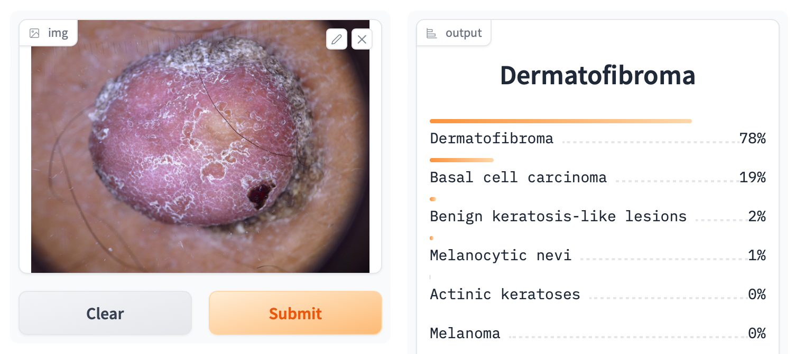
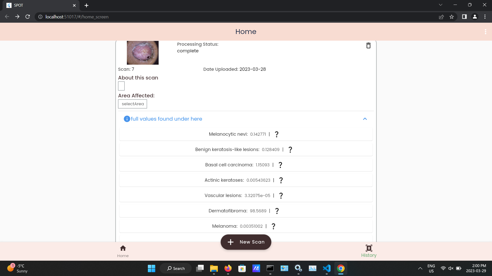

Test Case Name: Intagrated Accuracy 

Test Case ID: TCIA1

Test Objective: see the error betweem our AI creation environment vs  User environment (UI)

Preconditions: NA

Test Steps:

1. get the AI prediction results for some test picture in our AI environment 
2. get the AI prediction results for some test picture in our user environment (UI)

AI Results: 
Prediction : Dermatofibroma 78%

UI Results: 
Prediction : Dermatofibroma 98.5689%

 
$$
    |error| = |(AIprediction-UIprediction)/AIprediction|*100
$$

Error = 26.370%

  
