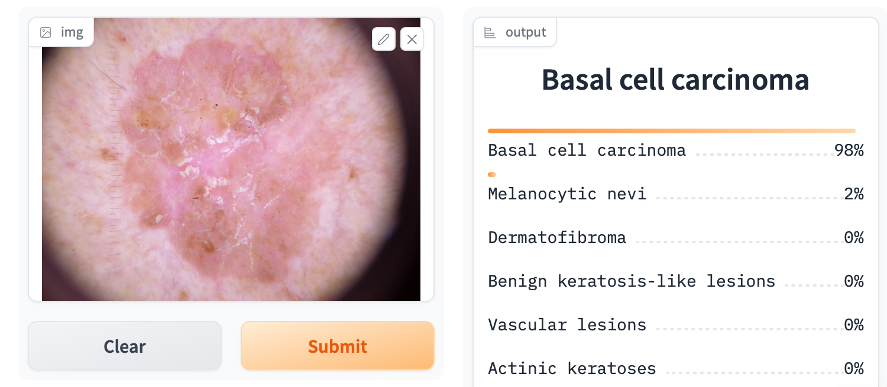
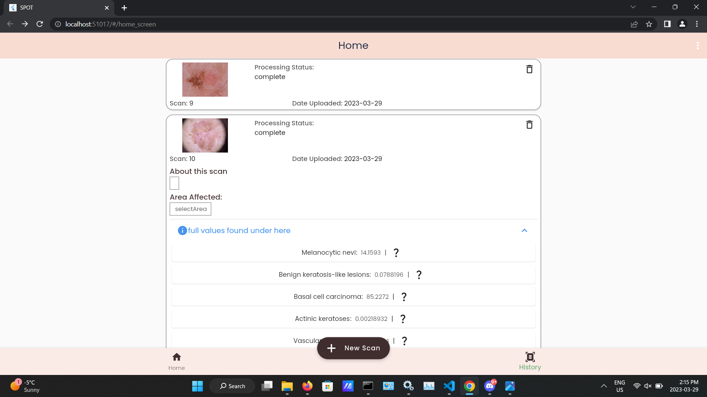

Test Case Name: Intagrated Accuracy 

Test Case ID: TCIA2

Test Objective: see the error betweem our AI creation environment vs  User environment (UI)

Preconditions: NA

Test Steps:

1. get the AI prediction results for some test picture in our AI environment 
2. get the AI prediction results for some test picture in our user environment (UI)

AI Results: 
Prediction : Basal cell carcinoma 98%

UI Results: 
Prediction : Basal cell carcinoma 85.2272%

 
$$
    |error| = |(AIprediction-UIprediction)/AIprediction|*100
$$

Error = 13.03346%

  
