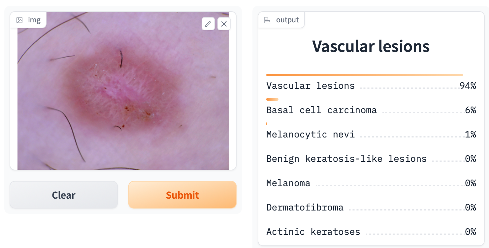
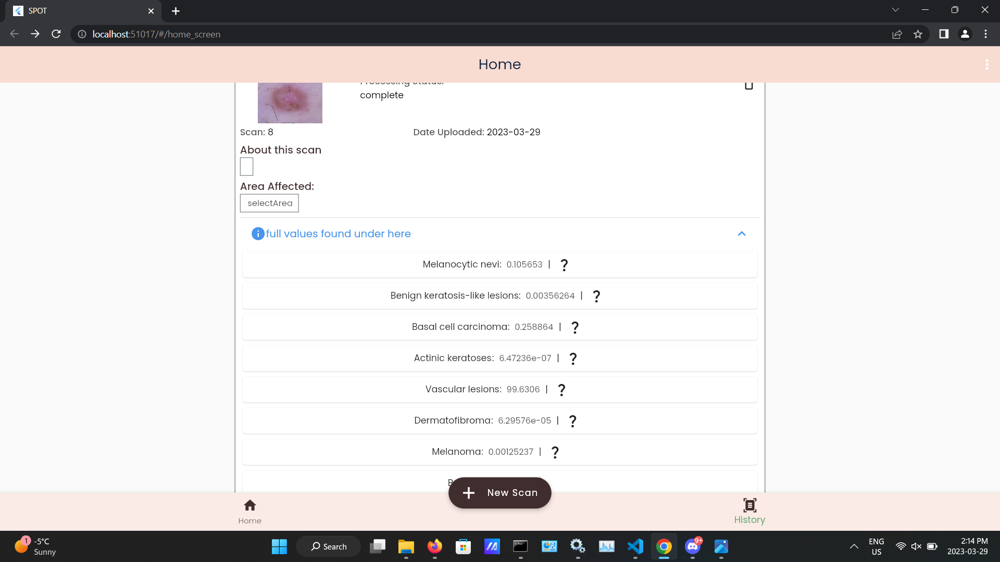

Test Case Name: Intagrated Accuracy 

Test Case ID: TCIA3

Test Objective: see the error betweem our AI creation environment vs  User environment (UI)

Preconditions: NA

Test Steps:

1. get the AI prediction results for some test picture in our AI environment 
2. get the AI prediction results for some test picture in our user environment (UI)

AI Results: 
Prediction : Vascular lesions 94%

UI Results: 
Prediction : Vascular lesions  99.8306%

 
$$
    |error| = |(AIprediction-UIprediction)/AIprediction|*100
$$

Error = 6.20276%

  
