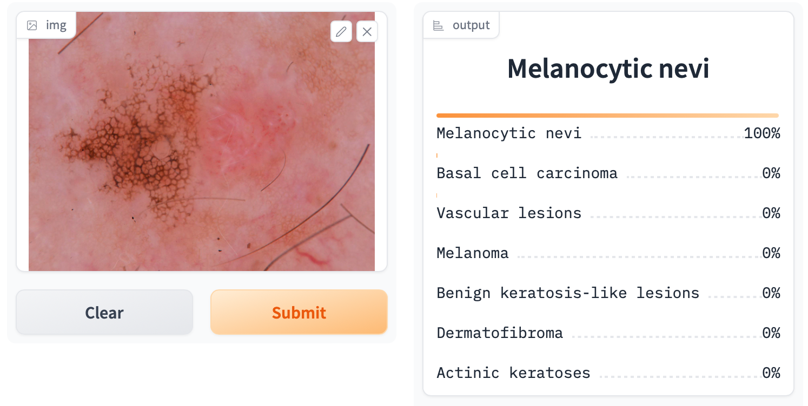
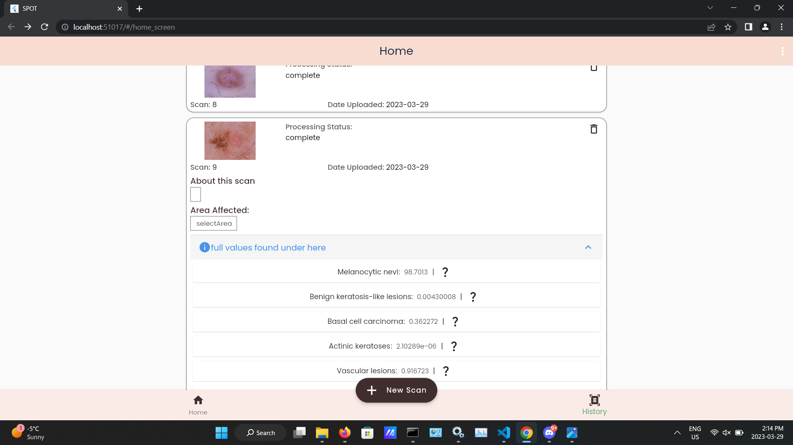

Test Case Name: Intagrated Accuracy 

Test Case ID: TCIA4

Test Objective: see the error betweem our AI creation environment vs  User environment (UI)

Preconditions: NA

Test Steps:

1. get the AI prediction results for some test picture in our AI environment 
2. get the AI prediction results for some test picture in our user environment (UI)

AI Results: 
Prediction : Melanocytic nevi 100%

UI Results: 
Prediction : Melanocytic nevi 98.7013%

 
$$
    |error| = |(AIprediction-UIprediction)/AIprediction|*100
$$

Error = 1.2987%

  
